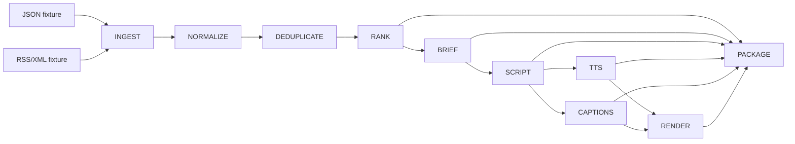
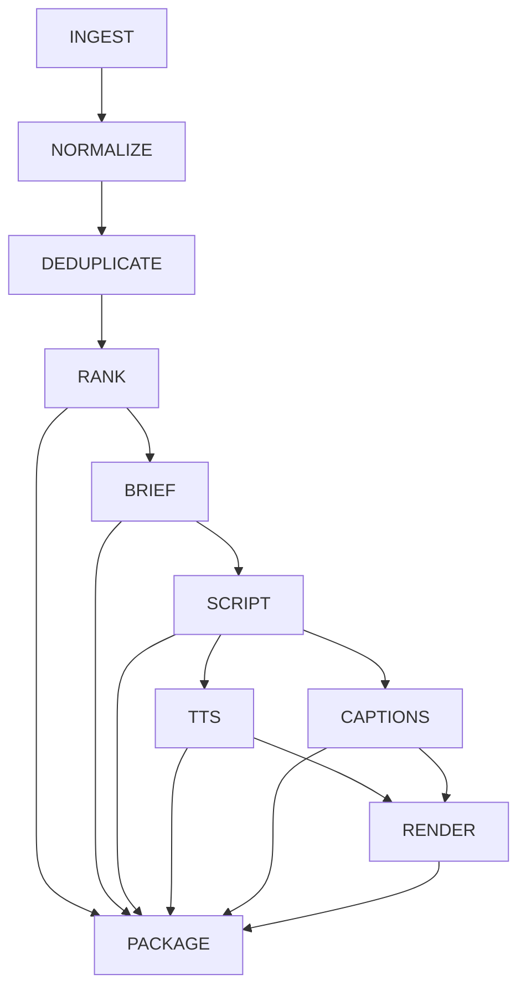

# Signal-to-Content Automation Pipeline

CI runs Ruff, compileall, and the offline pytest suite on pushes and pull requests.

An offline proof of transforming heterogeneous local engineering signals into inspectable downstream artifacts. It demonstrates deterministic stages, artifact lineage, safe cache reuse, isolated failures, and resume behavior.

## Why this exists

Multi-stage automations become fragile when every rerun starts from zero, provider failures erase progress, or output files have no lineage. This repository demonstrates a filesystem-backed pipeline where stages can be inspected and independently reused.

## Architecture



## Stage graph

The explicit dependency table is in `app/pipeline.py`; package depends on the selected signal and all final artifacts.



## Artifact manifest and fingerprints

Each run stores `manifest.json` and artifacts under `runs/<run-id>/`. Artifact records include type, relative path, SHA-256, size, timestamp and producer. Hashes provide provenance and integrity checks, not cryptographic authentication.

A stage key hashes its name and version, relevant configuration, and upstream artifact hashes using stable canonical JSON. Timestamps are excluded. A prior stage is reused only when it succeeded, its fingerprint matches, and every output exists with its recorded hash.

## Resumability and invalidation

On failure, the stage stores its bounded error and dependent work becomes blocked. Successful upstream artifacts remain available. Resume recomputes fingerprints and validates artifacts before reusing them.

- Changed fixture input invalidates ingest and descendants.
- Changed ranking configuration invalidates rank and descendants.
- Changed script provider settings invalidate script and media/package descendants.
- Changed render template invalidates render and package only.
- Missing or corrupted output rebuilds its producer and dependent stages.

Unchanged reruns report executed and reused stage counts. The proof shows avoided recomputation; it makes no throughput claims.

## 60-second demo

```sh
make install
make demo
```

The demo uses a temporary run directory, local synthetic fixtures, mock provider, generated WAV, captions, and mock renderer. It proves first run, full reuse, one isolated render failure, and resume.

For a persistent run:

```sh
make run-demo
python scripts/inspect_run.py demo
python scripts/resume_run.py demo
```

## Source adapters and structured analysis

JSON and RSS/XML adapters read local files only. Both normalize to a strict canonical signal with provenance. Deterministic eligibility reasons and exact-reference/content-hash deduplication are persisted. A narrow content-provider protocol returns validated classification, brief and script models. The final ranking is a deterministic weighted score with stable tie-breaking.

## Brief, script, audio and captions

Brief and script structures retain source references and bounded claims. Mock TTS creates a small deterministic synthetic WAV tone (not speech). Caption generation writes deterministic SRT offline. No transcription model is needed.

## Optional FFmpeg renderer

Select `--renderer ffmpeg` to create a simple local MP4 from generated color video and WAV. FFmpeg is optional; the always-available mock renderer creates a structured placeholder. No stock footage is used.

## Testing and performance characteristics

`make test` exercises source parsing, validation, deduplication, deterministic ranking, caching, integrity checks, invalidation, failure/resume, and CLI behavior. Successful artifacts are reused when fingerprints and hashes still match. Failure recovery starts at the earliest invalid stage.

## Repository structure

`app/` contains typed models, hashing, adapters, provider and orchestration. `examples/` has synthetic local sources. `scripts/` provides run, inspect, resume and demo entry points. `tests/` stays offline. `docs/architecture.md` explains implementation details.

## Claim boundaries

This project demonstrates multi-stage automation, source adapters, canonical normalization, deterministic filtering/deduplication, structured AI-assisted stages, provider abstraction, artifact provenance, caching, resumability, dependency-aware invalidation, media orchestration and optional FFmpeg integration.

It does not demonstrate social-media publishing, production social integrations, model training/fine-tuning, autonomous agents, distributed workflow infrastructure, production-scale media throughput, guaranteed model factuality, voice-agent specialization, or live Reddit/news ingestion. There is no publish, upload, or post stage or adapter. The pipeline ends at local artifact packaging.
